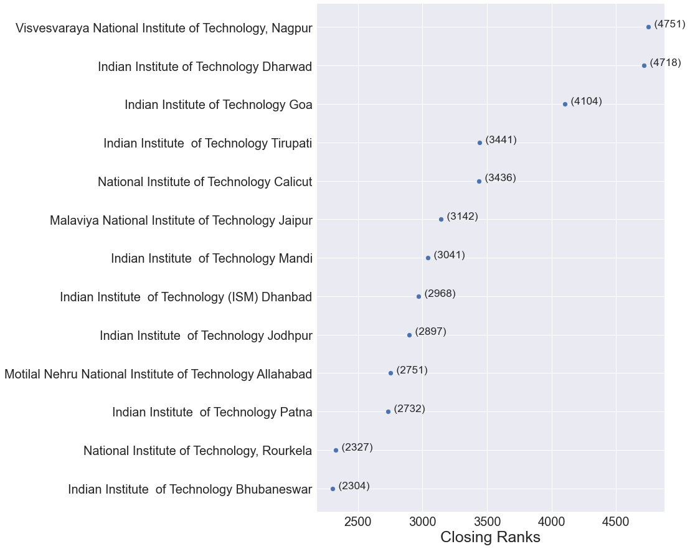

# jossa-cutoff-2021
JoSAA 2021 Opening and Closing Ranks spreadhseet file(s) &amp; pdf(s) along with a short analysis

#### Disclaimer
I am not affliated to JoSSA or any other body by any means. All data here is taken from official sources and is for educational purpose only.

---

## Downloads
Opening and Closing Rank for JoSAA 2021 Round 6 :
- [Excel Document](https://github.com/dvishal485/jossa-cutoff-2021/raw/main/josaa-cutoff.xlsx)
- [Portable Document Format (PDF)](https://github.com/dvishal485/jossa-cutoff-2021/raw/main/josaa-cutoff.pdf)
- [Google Sheets](https://docs.google.com/spreadsheets/d/1ftV86BdXwuJKV58S08wyNd9QfdTVxciJeu6GJ1CaDMg/edit?usp=sharing)
- [PDF sorted by Closing Ranks](https://github.com/dvishal485/jossa-cutoff-2021/raw/main/outputs/sort_by_closing_rank.pdf)

---

## Analysis
We will be using entirely the data of Round 6 if not mentioned otherwise.
Any cutoff trend/comparision is based on All India (`AI`) or Outside State (`OS`) Quota for `Gender-Neutral` and `OPEN` category.

- As we can see from the [cutoff files](#downloads) and the [jupyter notebook](./josaa-analysis.inpynb), there are a total of `9178` Opening & Closing Ranks from `114` different institutes providing `169` [different Academic Programs](./programs.pdf).
- The [Cutoff Information with Increasing order of Closing Ranks](./outputs/sort_by_closing_rank.xlsx) can be from the [Downloads section](#downloads). For only `OPEN` category, you can refer to [sort_by_closing_rank_general.xlsx](./outputs/sort_by_closing_rank_general.xlsx)
- The highest cutoff has been seen for `Indian Institute of Technology Bombay` (IIT-B) followed by `IIT Delhi` and `IIT Madras`.
- `Computer Science and Engineering (4 Years, Bachelor of Technology)` was found to be most demandful course.
- The list of top 10 colleges for CSE (4 years) is all occupied by IITs except one of the NITs namely `National Institute of Technology, Tiruchirappalli`
- Considering `Computer Science and Engineering (4 Years, Bachelor of Technology)` the cut-off(s) order are as follows :

    1. Highest Cutoff with Closing Ranks less than 2000

        
    2. Closing Ranks between 2000 and 5000

        
    3. Closing Ranks between 5000 and 10000

        
    4. Closing Ranks between 10000 and 20000

        
- Analysis for `Electronics and Communication Engineering (4 Years, Bachelor of Technology)`

    
- Analysis for `Mechanical Engineering (4 Years, Bachelor of Technology)`

    
- Analysis for `Civil Engineering (4 Years, Bachelor of Technology)`

    
- Analysis for `Electrical Engineering (4 Years, Bachelor of Technology)`

    
- If you want this kind of graph for other branches, use the [JoSAA Analysis Jupyter Notebook](./josaa-analysis.ipynb) or [raise an issue with the branch name](./issues)

---

## Generate on your own
All the information on Opening & Closing Ranks are taken from official [JoSAA Webpage](https://josaa.nic.in/Counseling/seatallotmentresult/currentorcr.aspx)

For generating excel file from other set of data follow these instructions :

1. Clone the repository on your system

    `git clone https://github.com/dvishal485/jossa-cutoff-2021.git`
1. Make sure to install all dependencies

    `pip install -r requirements.txt`
1. Open the [JoSAA Opening & Closing Ranks Webpage](https://josaa.nic.in/Counseling/seatallotmentresult/currentorcr.aspx)
1. Submit all the information in the form to view all data you need in webpage
1. Hit <kbd>Ctrl</kbd>+<kbd>s</kbd> and save the whole page as HTML as `JoSAA.html` (will probably be the default name)
1. Move the saved `JoSAA.html` into the root directory of repository cloned on your system
1. Run [main.py](./main.py) in the root folder
    
    `python main.py`
1. A new `josaa-cutoff.xlsx` will be saved in the root folder.

---

# License & Copyright

  - This Project is [Apache-2.0](./LICENSE) Licensed
  - Copyright 2021 [Vishal Das](https://github.com/dvishal485)
