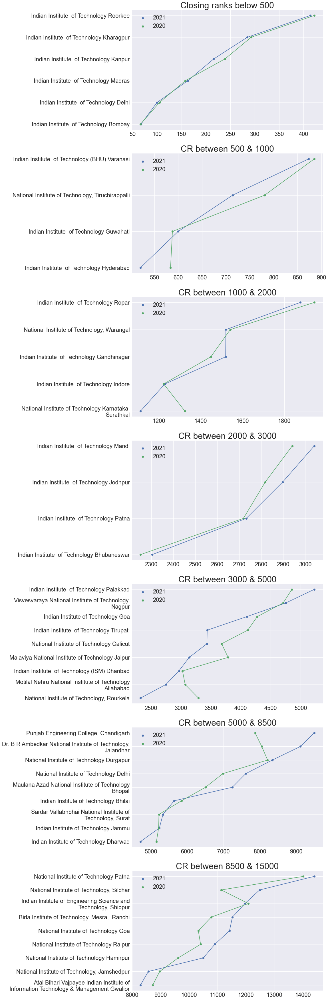
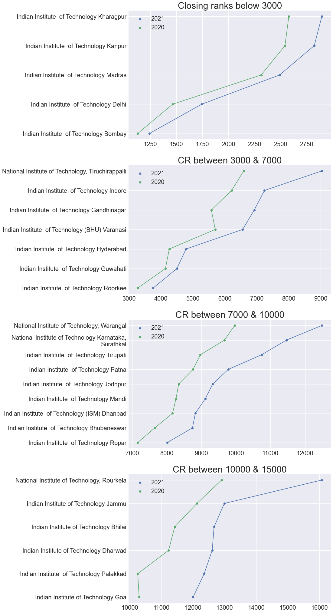
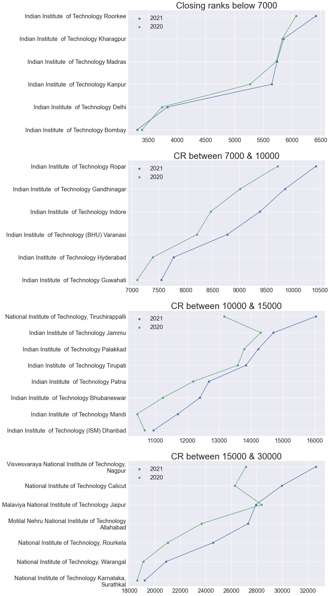
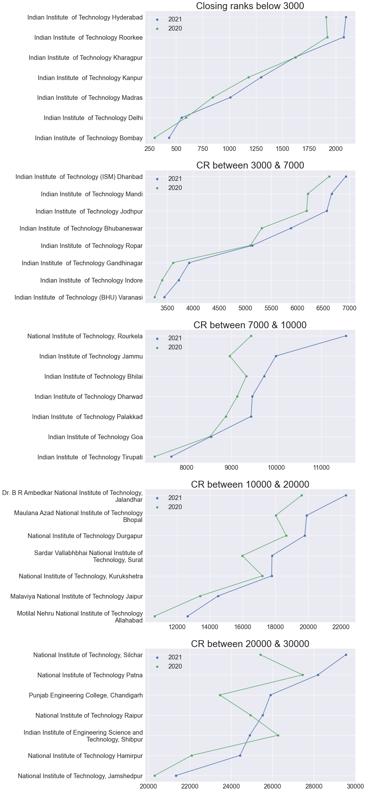

# JoSAA 2020 Cutoff
- [JoSAA 2020 Opening & Closing Ranks (R6)](https://github.com/dvishal485/jossa-cutoff-2021/raw/main/outputs/josaa-2020.xlsx)
- [Change in cutoff in 2021 & 2020 Analysis](https://github.com/dvishal485/jossa-cutoff-2021/raw/main/outputs/josaa-2021-20.xlsx)

---

## Analysis

1. In top tier colleges,
    - Among 5 year courses `Mathematics & Computing` was at higher demand than before, followed by `Electronics and Communication Engineering`
    - Among 4 year courses `Computer Science and Artificial Intelligence` was at higher demand than before
    - `Engineering Physics` (5 year) & `Food Engineering and Technology` (4 year) are some of those courses whose cutoffs lowered as compare to last year!
    - Note : Cutoffs also varies due to number of seatings newly introduced, which we are not considering.

1. In mid tier colleges,
    - Among 5 year courses `Physics ` was at higher demand than before, followed by `Computer Science and Engineering`
    - Among 4 year courses `Biotechnology and Biochemical Engineering` was at higher demand than before
    - `Computer Science and Artificial Intelligence` was found to be at 5th place
    - `Engineering Physics` (5 year) & `Food Engineering and Technology` (4 year) are some of those courses whose cutoffs lowered as compare to last year!
    - Note : Cutoffs also varies due to number of seatings newly introduced, which we are not considering.
1. Closing rank comparision of `Computer Science and Engineering` (4 years)

    
1. Closing rank comparision of `Mechanical Engineering` (4 years)

    
1. Closing rank comparision of `Civil Engineering` (4 years)

    
1. Closing rank comparision of `Electrical Engineering` (4 years)

    
